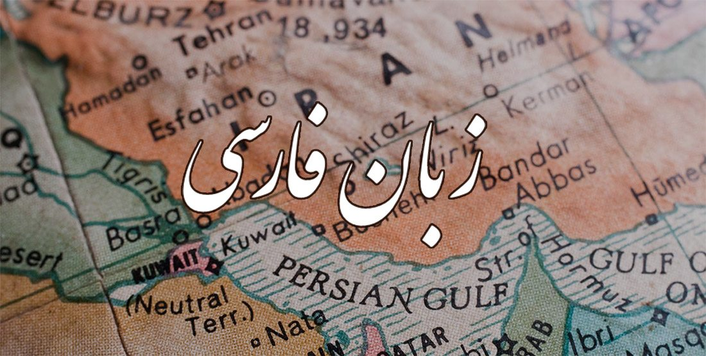

بسم الله 
 

    

# معادل‌های فارسی
 
 به نظرم هر زبانی که زایش واژه نداشته باشه یه روزی پایان حیاتش رو شاهد خواهیم بود. برای همین اگه شما هم دغدغه نگارش فارسی داری، می‌تونی اینجا مشارکت کنی. برگردان‌های مناسب فارسی برای واژه‌های بیگانه رو می‌تونیم این‌جا قرار بدیم و به دیگران توی نگارش فارسی کمک کنیم. شما هم اگه پیشنهادی داری می‌تونی مشارکت کنی و اون واژه رو به اسم خودتون این‌جا اضافه کنیم.
 
 ## از کجا شروع شد؟
 
خیلی ساده. در راستای رساله دکترا مدتی روی Trajectoryها کار می‌کردم. واژه پیشنهادی «خط سیر» بود اما این عبارت جاهای دیگه هم استفاده می‌شه. به نظرم رسید که واژه «مسیرواره» : مسیر + وار + هـ (هـ تبدیل صفت به اسم) معادل جالب‌تری باشه. به خصوص این‌که وقتی می‌خوای جمع‌ببندی به جای «خط سیرها» می‌تونی بگی «مسیرواره‌ها». 
 
 مسیرواره یعنی مثل مسیر؛ درست مشابه ماهواره (ماه + وار + هـ) که یعنی مثل ماه (از این نظر که به دور زمین می‌چرخه). به نظرم رسید برای کمک به نگارش بهتر فارسی معادل‌های خوبی که به مرور زمان به ذهنمون می‌رسه یا از دیگران می‌بینیم رو می‌تونیم یه جا بذاریم که همه استفاده کنن. 
 
 ## مهربان‌تر باشیم
 
 واژه‌های جدید شاید اولش برا همه سخت و نامانوس باشن اما به هر حال برای زنده موندن هر زبانی باید کمی با زایش واژه‌های جدید اون زبان، مهربان‌تر باشیم. 
 
 ## مالکیت معنوی
 هر واژه مناسبی که پیشنهاد بشه به نظرم مالکیت معنوی اون باید به اسم فرد پیشنهاد دهنده ثبت بشه. من توی وب و فضای مجازی هر واژه جالبی که ببینم به اسم همون فرد این‌جا می‌ذارم. اگه نسبت به این موضوع اعتراضی هم وجود داشته باشه توی قسمت Issues از اون استقبال می‌شه. به هر حال جای خالی یه مرجع مردمی برای حفظ زبان فارسی و کمک به نگارش فارسی خالیه و به نظرم این هم از اون حوزه‌ها هست که باید خودمون به دست بگیریم و منتظر این نباشیم که فلان نهاد کاری کنه. برای همین مالکیت معنوی و مشارکت مردمی یکی از رکن‌های اساسی این کار هست.
 
 
 # واژه‌ها
 
- [عمومی](./General/general.md)
- [ژئوماتیک](./Geomatic/geomatic.md)
- [مالی](./Finance/finance.md)

***
## برنامه‌نویسی و نرم‌افزار

فارسی               | انگلیسی                   | مالکیت معنوی       |           لینک/مرجع
---                 | :--                 | ---     | --- 
هم‌روند-هم‌گام        | Synchronous               | 
ناهم‌گام             | Asynchronous              |
محک‌خورده            | Best Practice             | حسین نریمانی راد
چندخدمتی            | Multitasking              | حسین نریمانی راد   
تلون‌پذیر            | Mutable                   | حسین نریمانی راد    | تلون یعنی رنگ گرفتن. گوناگون شدن. تلون مزاج یعنی: بی‌قراری و بی‌ثباتی
تلون‌ناپذیر          | Immutable                  | حسین نریمانی راد    |
ناوردا              | Invariant                 |
هم‌وردا              | Covariant
چندخدمتی            | Multitasking              | حسین نریمانی راد  
متن                 | Text                      |
خط                  | Scrip                     |
نویسه               | Character                 |
مجموعه نویسه        | Character Set             | 
شکل                 | Glyph                     | 
متد الحاقی          | Extension Method          | 
کلان داده            | Big Data
جنگل تصادفی         | Random forest             |
ناهنجاری            | Outlier                   | 
ویژگی               | Feature                   | 
فضای ویژگی          | Feature space             |
شاخص گذاری          | Indexing                  | محمدمهدی نوروزی    | [لینک](https://www.linkedin.com/posts/muhammad-mahdi-norouzi_sql-server-performance-tuning-ugcPost-6901141670013071360-wnt6)
